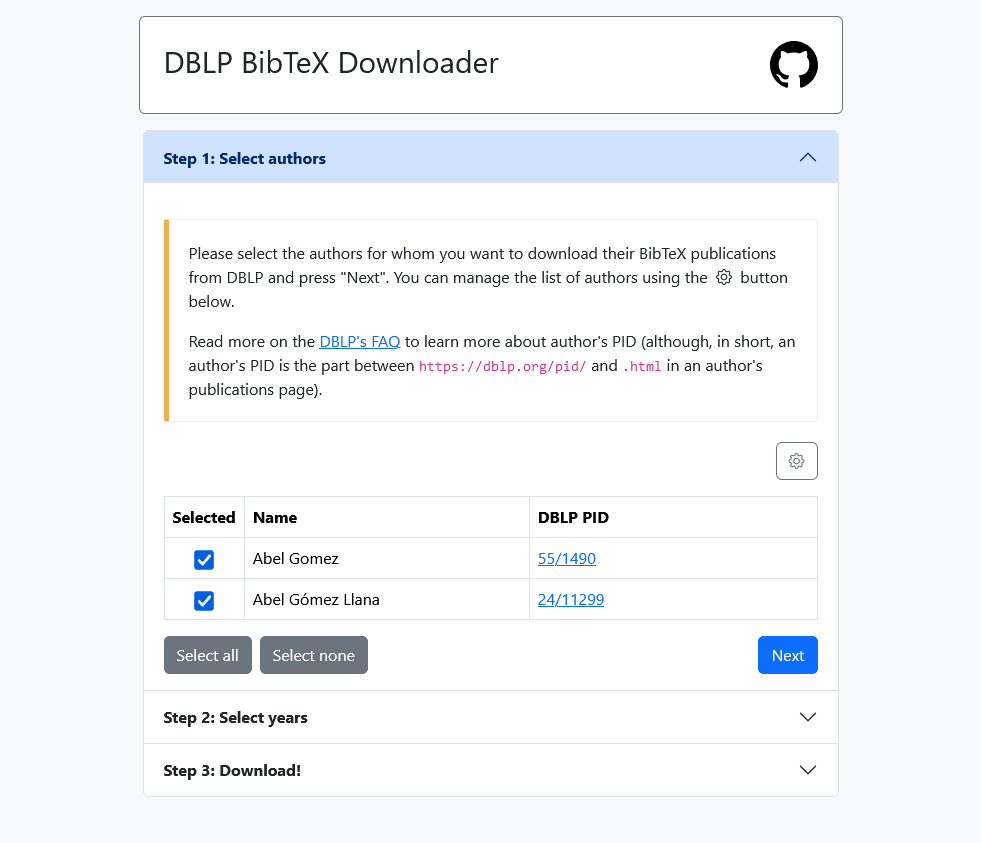

# DBLP BibTeX Downloader

_DBLP BibTeX Downloader_ is a simple command line application, web application, and REST service, that allows downloading BibTeX entries from DBLP for selected users. The application can filter out results outside a desired period of years.

The list of selected users must be provided as a CSV file, according to the following format:

```
# Lines starting with '#' are comments
# Empty lines are ignored
#
# Any manually introduced comment or empty line will be deleted between executions!!
# 
# IMPORTANT: The first non-empty, uncommented line MUST BE "author,pid"

author,pid

"John Doe","01/2345"
"Jane Doe","x/JaneDoe"
```

Notice that the PIDs are the "unique identifiers" used by DBLP. [According to their FAQ](https://dblp.org/faq/How+to+find+the+key+of+a+person+a+publication+or+a+stream.html):

> In many ways, persons are identified in dblp on basis of the persons name string (optionally followed by a four digit number in case of several authors in dblp with the same name). That name can be found prominently in the grey bar at the top of a person's page.

> However, there is also a (more cryptic) **unique identifier** associated with a dblp person record. You can find this key listed in the "export" drop down menu right next to the name. The key can also be found as the "key" attribute of the "person" element in a persons XML export.

Thus, we use this identifier in this program (removing the `pid/` or the `homepage/` prefix that apprears in different places of the site). This identifier can also be easily found in the address of an author's record.

Using as an example my personal record (https://dblp.org/pid/55/1490.html), my PID is `55/1490`.

# Dependencies

This project relies on:

* Flask 3, as the framework for the REST API: https://flask.palletsprojects.com/en/3.0.x/
* BibtexParser 1.x, to parse and filter BibTeX files: https://github.com/sciunto-org/python-bibtexparser/tree/v1
* Waitress 3.0, as the WSGI server: https://github.com/Pylons/waitress

To install the dependencies run:

```
pip install -r requirements.txt 
```

# Web interface

The web interface is a simple web page that presents the following three steps:

* **Step 1**: Select authors. During this step it is also possible to edit the author's database. Changes in the author's database are permanent and persisted at the server level.

    <center></center>

* **Step 2**: Select the desired period

    <center></center>

* **Step 3**: Download the references

    <center></center>

**NOTE**: Retrieval of citation may take some time, since the REST API waits 1 second between the requests of the different authors to avoid overloading the DBLP site, as suggested in https://dblp.org/faq/Am+I+allowed+to+crawl+the+dblp+website.html

# Command line interface

Publications can be downloaded from the command line using the `dblpdw.py` program. Notice that if the program is executed using a non-existing file, an empty file will be created that can be used as a template.

```
usage: dblpdw.py [-h] -a AUTHORS_FILE [-s START_YEAR] [-e END_YEAR]

Download publications as BibTeX from DBLP

optional arguments:
  -h, --help            show this help message and exit
  -a AUTHORS_FILE, --authors-file AUTHORS_FILE
                        Authors file, containing the author's names and their DBLP keys in CSV. An empty file will be created if the given file does not exist.
  -s START_YEAR, --start-year START_YEAR
                        start year
  -e END_YEAR, --end-year END_YEAR
                        end year
```

# REST Endpoints

**IMPORTANT:** for compatibility and readability purposes, fordward slashed in PIDs must be substituted by hyphens when using the REST API.

## `/authors`

Allowed methods:

* `GET`: returns a list with all the registered authors.

    E.g.:

    ```
    curl -X GET http://example.com/authors
    ```

    returns:

    ```
    [
        {"pid": "01/2345", "name": "John Doe"},
        {"pid": "x/JaneDoe", "name": "Jane Doe"}
    ]
    ```

## `/author/<pid>`

Allowed methods 

* `GET`: returns an authors record.

    E.g.:

    ```
    curl -X GET http://example.com/author/01-2345
    ```

    returns:

    ```
    { "name":"John Doe","pid":"01/2345" }
    ```

    Return codes:
    * `200`: OK
    * `404`: The given author does not exist

* `PUT`: Creates or updates an author record (mostly its name). The pid inside the payload must match the pid in the URL.

    E.g.:

    ```
    curl -X PUT http://example.com/author/01-2345 -H "Content-Type: application/json" -d '{"name":"Johnny Doe","pid":"01/2345"}'
    ```

    changes the name of `John Doe` to `Johnny Doe`

    Return codes:
    * `204`: successful (but no content response is needed)
    * `400`: The author data does not matches the PID in the URL

* `DELETE`: Deletes an author record.
    
    E.g.:

    ```
    curl -X DELETE http://example.com/author/01-2345
    ```

    deletes author John Doe.

## `/publications/<comma_separated_pids>?start=<start>&end=<end>`

* `GET`: Returns the list of publications in BibTeX for the given authors between the `start` and `end` years (inclusive).

    E.g.:

    ```
    curl -X GET http://example.com/publications/01-2345,x-JaneDoe?start=2023&end=2024
    ```

    returns the publications in BibTeX for both John Doe and Jane Doe for the period 2023-2024.

    **NOTE**: The REST API waits 1 second between the requests to DBLP for the different authors to avoid overloading the site, as suggested in https://dblp.org/faq/Am+I+allowed+to+crawl+the+dblp+website.html

